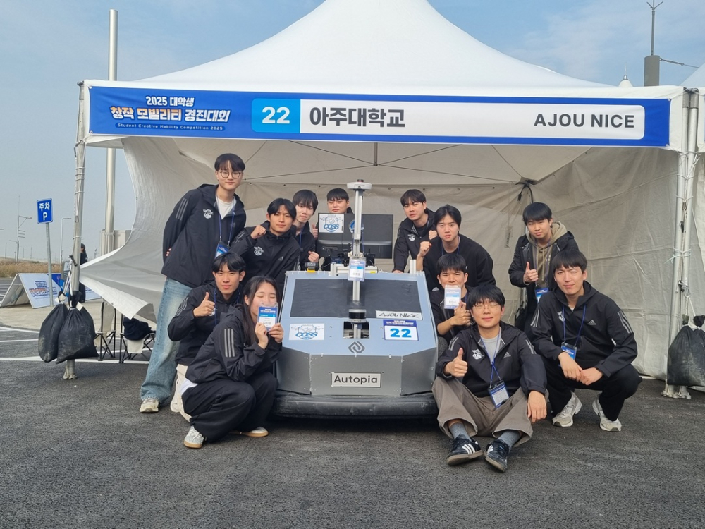
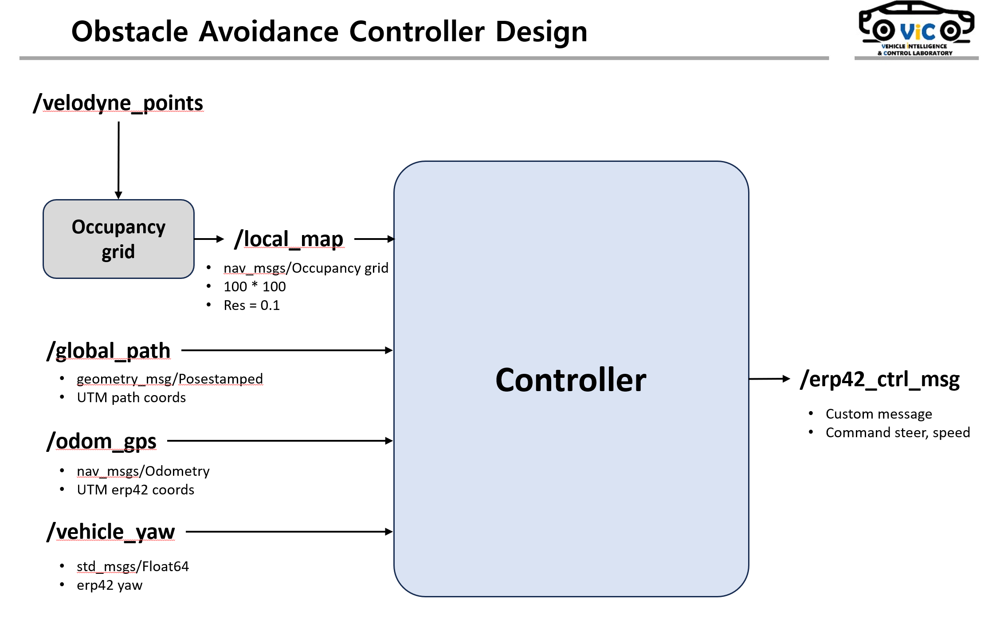
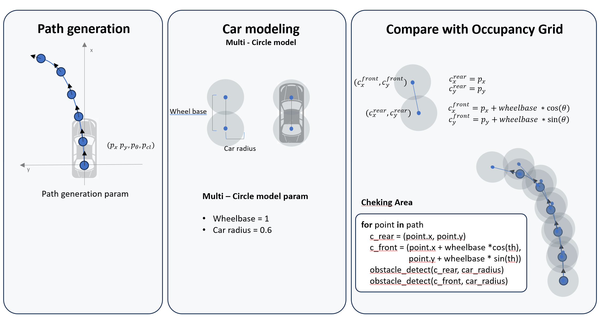

# 2025 무인 모빌리티 경진대회

  
  

**2025 창작 모빌리티 경진대회 [무인 모빌리티 경진 대회 부문]**

# Obstacle Avoidance

This code implements the obstacle avoidance algorithm for the **ERP42** platform.

You can change the path shapes and scoring methods depending on the situation.

## Small Obstacle Avoidance

  
  

## Big Obstacle Avoidance

  
  

## Can be used for rubber cone driving.

  

# System Pipeline, Algorithm

  

  

**Data Integration Note:**
Due to system connectivity, only $(x, y)$ coordinates are used from the `/odom` topic. The vehicle's yaw angle in the map frame is separately retrieved and managed via the `/vehicle_yaw` topic.

