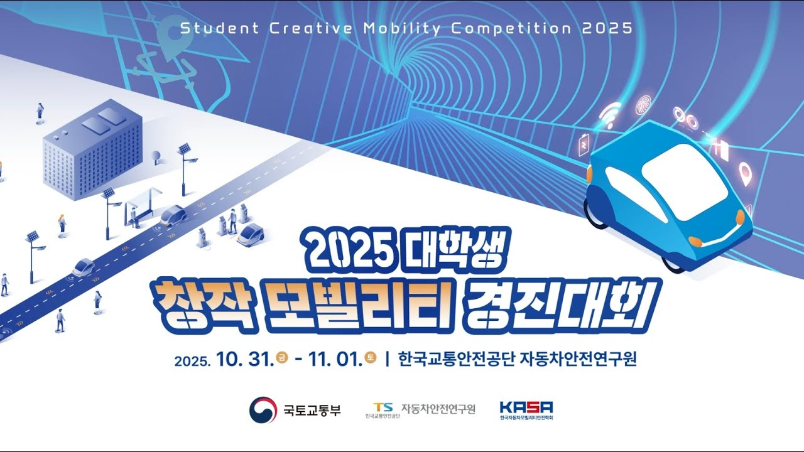
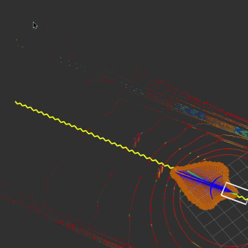
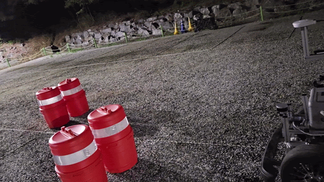
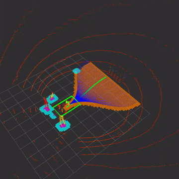
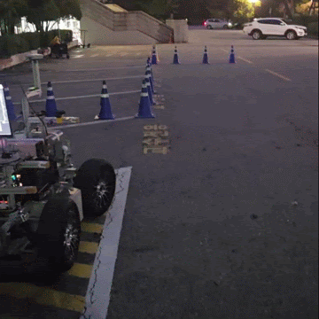
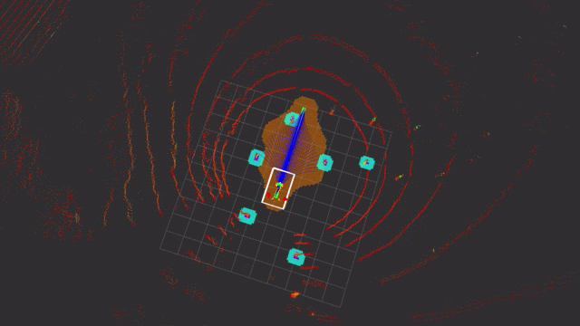

# 2025 무인 모빌리티 경진대회

# Obstacle Avoidance

This code implements the obstacle avoidance algorithm for the ERP42 platform.
You can change the path shapes and scoring methods depending on the situation.

## Small Obstacle Avoidance

  
  

## Big Obstacle Avoidance

  
  

## Rubber Cone Drive

  

